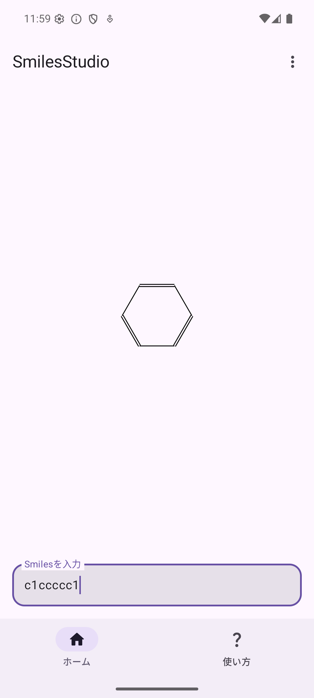
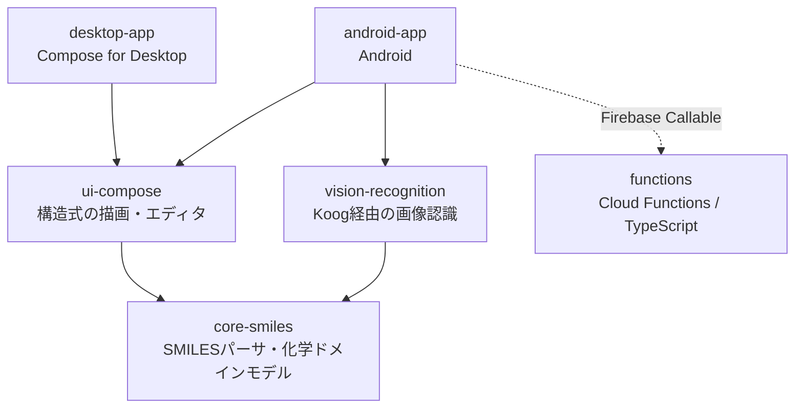

# SmilesStudio

化学を学ぶ学生のための、SMILES記法エディタ＆構造式描画ツールです。
Kotlin Multiplatform と Compose Multiplatform で、Android とデスクトップの両方に対応しています。

<p align="center">
  
</p>

## なぜ作ったのか

SMILESは分子構造を1行の文字列で表す記法です。データベースや計算化学では広く使われていますが、
文字列だけでは構造を思い浮かべにくく、書き間違いにも気づきにくいという難しさがあります。
応用化学を専攻する開発者自身がこの不便さを感じていたことから、
「書いたSMILESがその場で構造式として見える」ツールとして開発を始めました。

## 主な機能

- **SMILESの入力と構造式のリアルタイム描画**
  鎖・分岐・環閉包・芳香族（小文字表記）に対応しています。芳香環はケクレ構造として描画します。
- **手描き構造式の認識（Android）**
  紙に描いた構造式を撮影すると、Vision LLMがSMILESに変換し、構造式として描き直します。
  認識結果は入力欄に反映されるので、そのまま確認・修正できます。
- **APIキーの持ち込み（BYOK）または回数制の無料枠**
  自分のGemini APIキーを使うか、アプリが用意した無料枠を使って認識機能を利用できます。

## ステータス

開発中です。SMILESのパース、構造式の描画、Android版の手描き認識機能は実装済みで、
Google Playでの公開に向けて準備を進めています。

## アーキテクチャ



| モジュール | 役割 |
| --- | --- |
| `core-smiles` | 純粋なKotlin。SMILESのパースと化学ドメインモデル（原子・結合・分子）、2Dレイアウト、ケクレ化。UIやプラットフォームに依存しません。 |
| `ui-compose` | Compose Multiplatform。構造式を描画するCanvasとエディタを、Android・デスクトップで共有します。 |
| `vision-recognition` | JetBrains [Koog](https://github.com/JetBrains/koog) を使い、画像からSMILESを認識します。結果は成功・失敗を型で表現します。 |
| `android-app` | Androidアプリのエントリポイント。画像入力、APIキー管理（Android Keystoreで暗号化）、課金（RevenueCat）を担当します。 |
| `desktop-app` | Compose for Desktop のエントリポイント。 |
| `functions` | Firebase Cloud Functions（TypeScript）。アプリ提供のAPIキーで認識を行うプロキシと、無料枠の回数管理を行います。 |

ドメインロジックを `core-smiles` に閉じ込めているため、デスクトップ版として始めたプロジェクトに
Android版を追加した際も、パーサと描画処理を変更せずに再利用できました。

## 設計ドキュメント

このリポジトリでは、コードと同じくらい「なぜそうしたか」を大切にしています。

- **[`CONTEXT.md`](./CONTEXT.md)** — ドメイン用語集。「暗黙の水素数」「芳香族原子」「環」などの
  化学の概念が、コード上でどう表現されているかを定義しています。
- **[`docs/any-decision-record/`](./docs/any-decision-record/)** — 設計判断の記録（130件以上）。
  技術選定やデータ構造、スコープの判断を、検討した代替案とともに残しています。
  例: [芳香族性を結合から導出する](./docs/any-decision-record/0004-derive-aromaticity-from-bonds.md)、
  [DIフレームワーク導入を再検討する条件](./docs/any-decision-record/0138-di-framework-reconsideration-triggers.md)
- **[`docs/any-action-record/`](./docs/any-action-record/)** — 作業の記録。各Issueで何をしたかを時系列で残しています。

## 開発の進め方

AIコーディングエージェントと協働して開発しており、そのルールを [`CLAUDE.md`](./CLAUDE.md) に定めています。

- 新しい機能や設計に取りかかる前に、エージェントに2〜3の実装案をメリット・デメリットつきで提示させ、
  人間が選んでから実装に進みます。
- 実装はテスト駆動開発（TDD）の5段階（テスト作成 → 骨組み → 失敗の確認 → 実装 → リファクタリング）で進め、
  全テストの成功を確認してから完了とします。

## ビルドと実行

ビルドにはJDK 21のツールチェーンを使います（手元にない場合はGradleが自動で取得します）。

```bash
# 全モジュールのビルド
./gradlew build

# 全テストの実行
# core-smiles などはKotlin Multiplatformモジュールのため、`test` ではなく `allTests` を使います
./gradlew allTests

# デスクトップアプリの起動
./gradlew :desktop-app:run

# Androidアプリのビルド（Android Studioから実行することもできます）
./gradlew :android-app:assembleDebug
```

デスクトップアプリは追加の設定なしで起動できます。構造式の描画を試すだけなら、こちらが手軽です。

Androidアプリは `google-services.json` と `revenuecat.properties` がなくてもビルドはできますが、
起動時にFirebaseを使うため、実行するには `android-app/google-services.json` に
Firebaseプロジェクトの設定ファイルを置く必要があります。

## 今後の予定

- Google Playでの公開
- 化学の知識はあるが開発経験の浅い人でも安全にコントリビュートできるよう、
  型システム・AIレビュー・既知の化合物に対する期待値テストによる仕組みを整備

## ライセンス

MIT — [LICENSE](./LICENSE) を参照してください。
